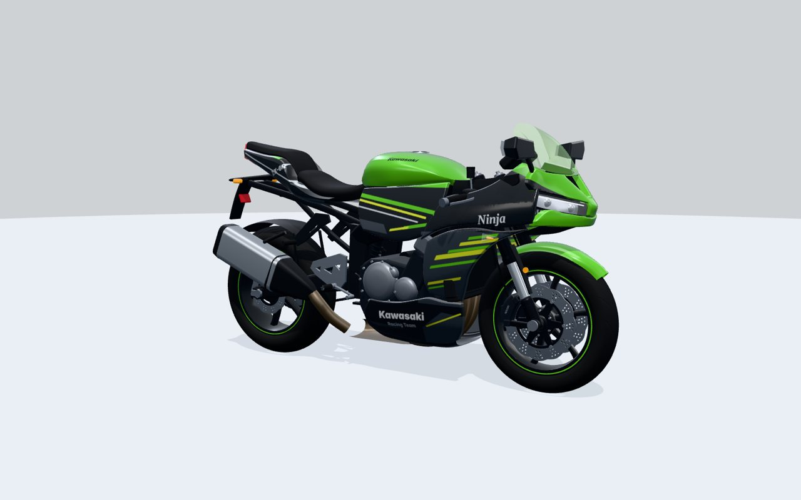
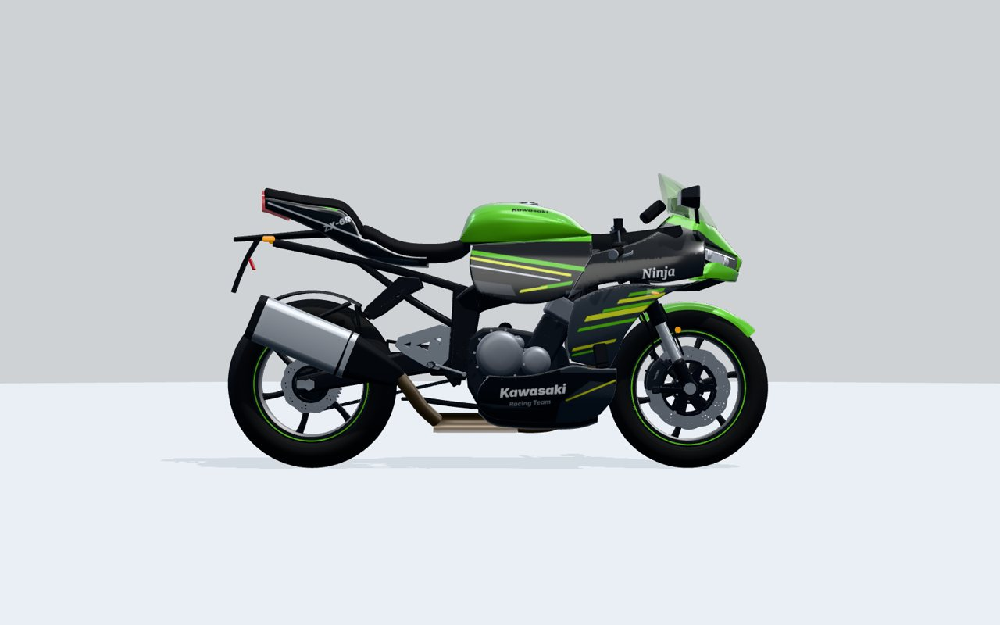
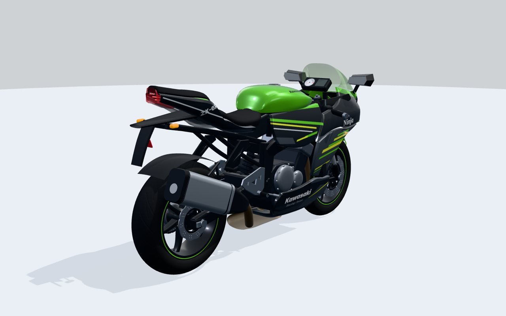
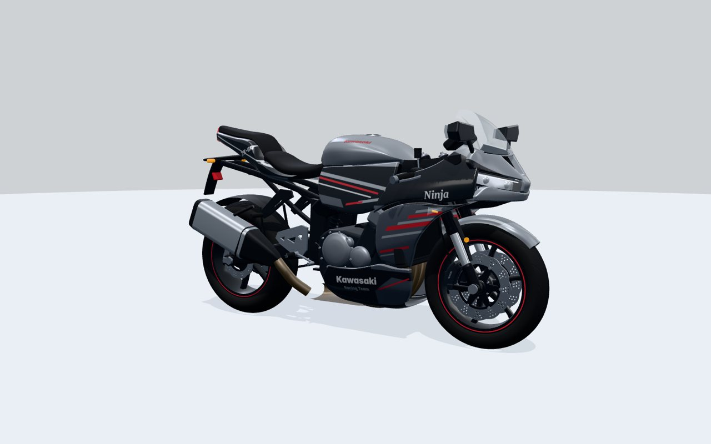
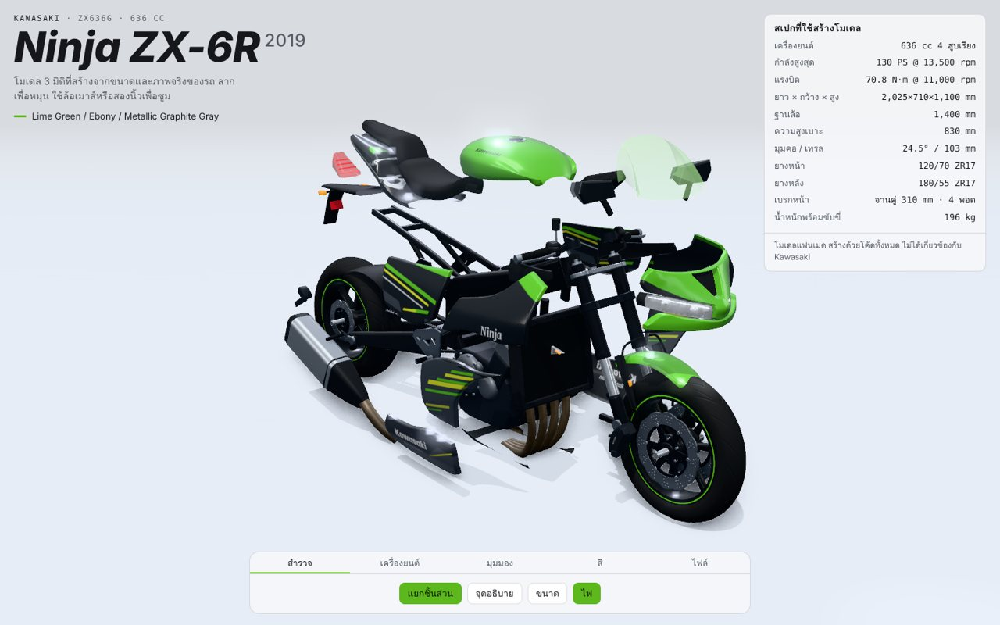
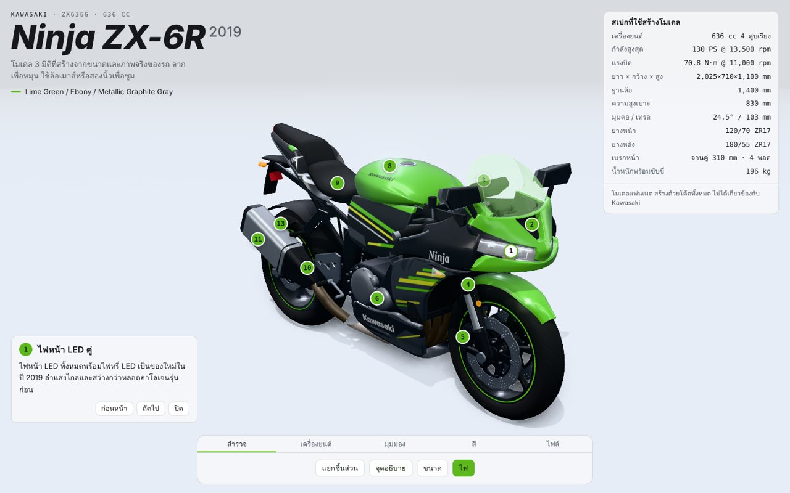
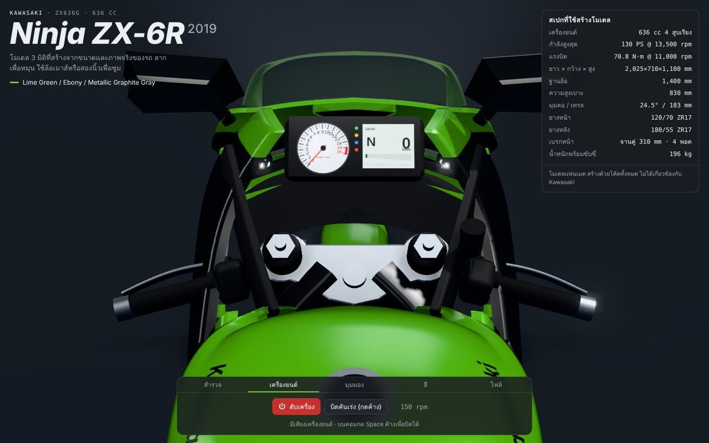

# Kawasaki Ninja ZX-6R 2019 — โมเดล 3 มิติ

โมเดล 3 มิติของ **Kawasaki Ninja ZX-6R ปี 2019 (ZX636G)** สร้างด้วยโค้ด three.js ทั้งคัน
ไม่ได้ใช้ไฟล์โมเดลหรือรูปภาพจากภายนอก สัดส่วนอิงจากสเปกจริง และรูปทรงแฟริ่งลอกจากภาพถ่ายด้านข้างของรถจริง
ที่ปรับสเกลด้วยฐานล้อ 1,400 mm



| ด้านข้าง | ด้านหลัง ¾ | สี Pearl Storm Gray |
| --- | --- | --- |
|  |  |  |

## หน้าดูโมเดล (`index.html`)

| แยกชิ้นส่วน | จุดอธิบายชิ้นส่วน | มุมคนขี่ + สตาร์ทเครื่อง |
| --- | --- | --- |
|  |  |  |

- **สำรวจ**: แยกชิ้นส่วนแบบเคลื่อนไหว, จุดอธิบาย 13 จุดเป็นภาษาไทย, เส้นบอกขนาด, เปิด/ปิดไฟ, ตารางสเปก
- **เครื่องยนต์**: สตาร์ทเครื่องพร้อมเสียงเครื่อง 4 สูบที่สังเคราะห์ในเบราว์เซอร์ กดค้างเพื่อบิดคันเร่ง (บนคอมกด Space ค้างได้)
  เข็มวัดรอบและจอ LCD บนหน้าปัดขยับตามรอบจริง
- **มุมมอง**: หน้า ¾, ข้าง, หลัง ¾, หน้า, บน, มุมคนขี่ และหมุนอัตโนมัติ
- **สี**: KRT Edition และ Pearl Storm Gray
- **ไฟล์**: บันทึกภาพ PNG และดาวน์โหลดโมเดล GLB
- ภาพมีเงาในซอกด้วย ambient occlusion และไฟ LED มีแสงฟุ้ง (bloom) ถ้าเครื่องช้าจะลดคุณภาพลงเอง

## ไฟล์ที่ใช้งานได้ทันที

| ไฟล์ | ใช้ทำอะไร |
| --- | --- |
| `models/kawasaki-zx6r-2019.glb` | โมเดลสี KRT Edition (Lime Green / Ebony / Graphite Gray) เปิดได้ใน Blender, Windows 3D Viewer, https://gltf-viewer.donmccurdy.com ฯลฯ |
| `models/kawasaki-zx6r-2019-gray.glb` | โมเดลสี Pearl Storm Gray / Metallic Spark Black |
| `index.html` | หน้าเว็บดูโมเดล (รายละเอียดด้านบน) |

ไฟล์ GLB ใช้หน่วยเมตร ขนาดจริง (แกน +X ไปทางหน้ารถ, +Y ขึ้นบน) ประมาณ 198,000 สามเหลี่ยม แยกชิ้นส่วนตามชื่อ
เช่น `Nose`, `UpperSideCowl`, `Tank`, `TailCowl`, `FrontWheel`, `FrontFork`, `Engine`, `Exhaust` เพื่อให้แก้ไขต่อได้ง่าย

## เปิดหน้าดูโมเดลในเครื่อง

```bash
npm install          # ติดตั้ง three.js และเครื่องมือ (หน้าเว็บโหลด three.js จาก CDN เอง)
npm run serve        # แล้วเปิด http://localhost:8080
```

## สเปกที่ใช้สร้างโมเดล

| รายการ | ค่า |
| --- | --- |
| เครื่องยนต์ | 636 cc 4 สูบเรียง DOHC 16 วาล์ว |
| กำลังสูงสุด | 130 PS @ 13,500 rpm (136 PS เมื่อมี ram air) |
| แรงบิดสูงสุด | 70.8 N·m @ 11,000 rpm |
| น้ำหนักพร้อมขับขี่ | 196 kg |
| ยาว × กว้าง × สูง | 2,025 × 710 × 1,100 mm |
| ฐานล้อ | 1,400 mm |
| ความสูงเบาะ | 830 mm |
| มุมคอ / เทรล | 24.5° / 103 mm |
| ยาง | หน้า 120/70 ZR17, หลัง 180/55 ZR17 |
| เบรก | หน้า จานคู่ 310 mm คาลิปเปอร์ Nissin 4 พอต, หลัง จาน 220 mm |
| ช่วงล่าง | หน้า Showa SFF-BP 41 mm หัวกลับ, หลัง Bottom-link Uni-Trak |

ขนาดกล่องครอบของโมเดลที่ได้: 2,015 × 725 × 1,100 mm (ต่างจากสเปกไม่เกิน 2%)

## รายละเอียดที่สร้างไว้

- **ด้านหน้า**: หน้ากากทรง "pug nose" ของปี 2019 ที่จงอยสีเขียวลงมาคั่นกลางไฟหน้า, ไฟหน้า LED 2 ดวงพร้อมโปรเจกเตอร์และไฟหรี่,
  ช่อง ram air, คางพร้อมครีบ, ชิลด์ทรงโดม, กระจกมองข้างทรงลิ่ม
- **แฟริ่ง**: แผงข้างแยกเป็นชิ้นจริง 4 ชิ้นต่อข้าง (ชิ้นบน "Ninja", ชิ้นกลาง, ฝาข้างใต้ถัง, อันเดอร์คาวล์) ขอบม้วนเข้าและมีร่องระหว่างชิ้น
  ไฟเลี้ยวหน้าฝังในแฟริ่ง
- **ช่วงล่าง**: โช้คหัวกลับ, แผงคอบน–ล่าง, จานเบรกทรงกลีบดอกแบบเจาะรู, คาลิปเปอร์เรเดียล, สายเบรก, ล้อ 6 ก้าน, ยางพร้อมลายดอก
- **ตัวรถ**: ถังน้ำมันพร้อมโลโก้ที่ฉายลงบนผิวถัง, เบาะคนขับและคนซ้อน, ท้ายทรงเหลี่ยมยกสูงพร้อมไฟท้าย LED, ท้ายสั้นยึดป้ายทะเบียน, ไฟเลี้ยวหลัง
- **เครื่องยนต์และโครง**: เฟรม, ซับเฟรม, สวิงอาร์ม, โช้คหลังพร้อมสปริง, เครื่อง 4 สูบพร้อมฝาครอบคลัตช์/ไดชาร์จ, หม้อน้ำ, เฮดเดอร์ 4 ท่อ,
  หม้อพักใต้เครื่อง, ปลายท่อสแตนเลสเหลี่ยม, โซ่และสเตอร์ 15/43 ฟัน, เกียร์โยง, ขาตั้งข้าง
- **หน้าปัด**: เข็มวัดรอบหน้าปัดขาว 0–16 (โซนแดง 15,000 rpm ขึ้นไป) และจอ LCD แสดงเกียร์/ความเร็ว
- **สีและลาย**: KRT Edition และ Pearl Storm Gray วาดด้วย canvas ในโค้ด

## โครงสร้างโค้ด

```
src/
  layout.js        ขนาดหลักและเรขาคณิตของคอรถ (rake/trail/offset)
  geom.js          เครื่องมือสร้างพื้นผิว: loft, lathe, sweep, extrude
  panel.js         สร้างแผงแฟริ่งจากเส้นขอบ 2 มิติ (triangulate + ม้วนขอบ + ขอบพับ)
  body.js          แฟริ่ง หน้ากาก ไฟหน้า ชิลด์ ถัง เบาะ ท้าย บังโคลน กระจก
  chassis.js       ล้อ ยาง เบรก โช้คหน้า แฮนด์
  frame.js         เฟรม สวิงอาร์ม โช้คหลัง โซ่ พักเท้า
  engine.js        เครื่องยนต์ หม้อน้ำ ท่อไอเสีย
  livery.js        ลายสีของรถ (วาดด้วย canvas)
  gauge.js         หน้าปัดที่วาดใหม่ตามรอบเครื่อง
  engine-sound.js  เสียงเครื่องยนต์สังเคราะห์ด้วย Web Audio
  materials.js     วัสดุและชุดสี
  studio.js        แสงและฉากสตูดิโอ
  viewer.js        หน้าเว็บดูโมเดล
  vendor/          delaunator (ISC) สำหรับ triangulation
tools/
  render.mjs           เรนเดอร์ภาพนิ่งด้วย Chromium แบบ headless
  export-glb.mjs       ส่งออกไฟล์ GLB  (node tools/export-glb.mjs [krt|gray])
  build-artifact.mjs   รวมหน้าเว็บเป็นไฟล์เดียว
  check-geometry.mjs   ตรวจหา normal/ตำแหน่งที่ผิดปกติในทุก mesh
```

---

โมเดลนี้เป็นงานแฟนเมดเพื่อการศึกษา ไม่ได้เกี่ยวข้องหรือได้รับการรับรองจาก Kawasaki Motors
ชื่อ Kawasaki, Ninja และ ZX-6R เป็นเครื่องหมายการค้าของเจ้าของ
